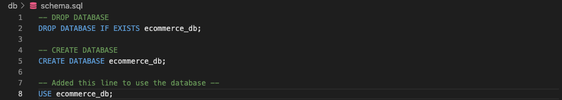
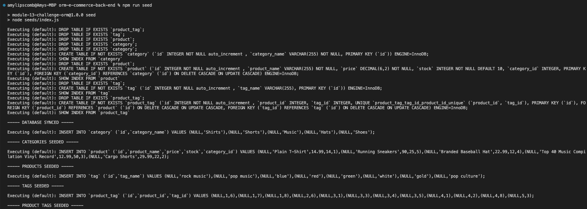
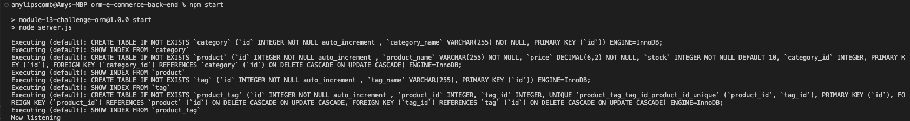
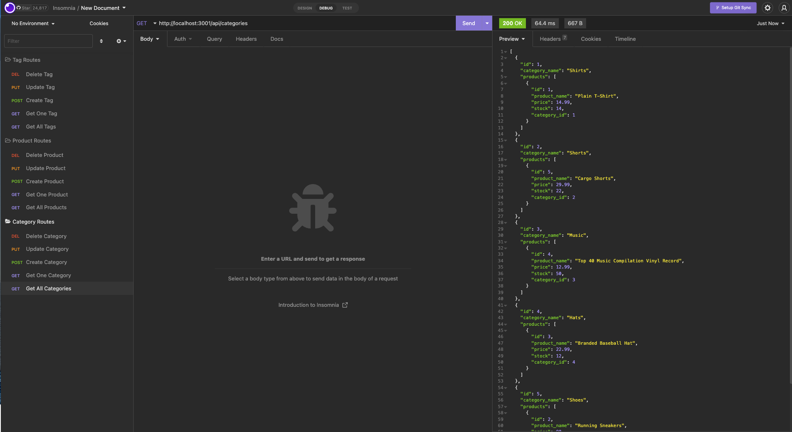

# Back End Coding with ORM 


## Description

As a full-stack web developer, it's important to know the inner workings of back-end coding, particularly regarding internet retail. Internet retail, also known as [e-commerce](https://www.businessnewsdaily.com/15858-what-is-e-commerce.html), is "the process of selling goods and services over the internet." My first job was working retail and I worked as a sales associate for 3 years. Over the course of my employment, I saw personally how each year, more and more consumers were choosing to buy online rather than in-person shopping. Since the pandemic, shopping online has become even more prevalent. As a result, it's important to understand the fundamental framework of platforms that businesses use daily. Please read along and watch my walkthrough [video](https://drive.google.com/file/d/1yZHMZsA5AfTfdSt_Yp-yFhvbDcphrZtZ/view) to see how I've used object-relational mapping (ORM) to build the back end for an e-commerce site! &#129321;


----
## Table of Contents 

  * [Installation](#installation)
  * [Usage](#usage)
  * [License](#license)
  * [Contribution](#contribution)
  * [Tests](#tests)
  * [Technologies](#technologies)
  * [Questions](#questions)

---
## Installation

To use the npm packages, "dotenv", "express", "mysql2" and "sequelize" , I typed the following code into the command line:

```
npm i 
```

---

## Usage

1. I first had to create the database. To do this, I used the following lines of code in the schema file and then copied and pasted them into WorkBench. 



2. Then I went back into the VS code and in the terminal, typed the command: 

```
npm run seed
```


3. Once the seed was run, it was time to start the server. So, I typed the command:

```
npm start
```


4. Once the server was started, I opened Insomnia (the application, not &#127850; &#128521;), and within the application, I did the following:
    * Created 3 folders, one for each route. 
    * Created 5 folders for each HTTP request, (GET, POST, PUT, DELETE).
    * Typed the URL, "http://localhost:3001/api/", and added the endpoint I was trying to run. 
      - In the screenshot below, the endpoint I was running was for /api/categories: 



*It's important to note, that if the code has to be fixed, then in order for the requests to be updated within Insomnia, the server has to be stopped and then re-run. To stop the server, the following command has to be used: 

```
control ^ + C
```

---

## Contribution

  None.

  ---

## License

```
This project is licensed under MIT.
```

---


## Tests

None.

 ---

 ## Technologies

* JavaScript
* SQL 
* MySQLWorkbench
* Node
    * npm packages:
       * [dotenv](https://www.npmjs.com/package/dotenv)
       * [express](https://www.npmjs.com/package/express)
       * [mysql2](https://www.npmjs.com/package/mysql2)
       * [sequelize](https://www.npmjs.com/package/sequelize)
        
* Insomnia 
* Screencatisfy
* VS Code

 ---

## Questions

If you'd like to see more of my projects, check out my github: [amylipscomb](https://github.com/amylipscomb).
For further information please contact me at [amy.a.lipscomb@gmail.com](mailto:amy.a.lipscomb@gmail.com)!